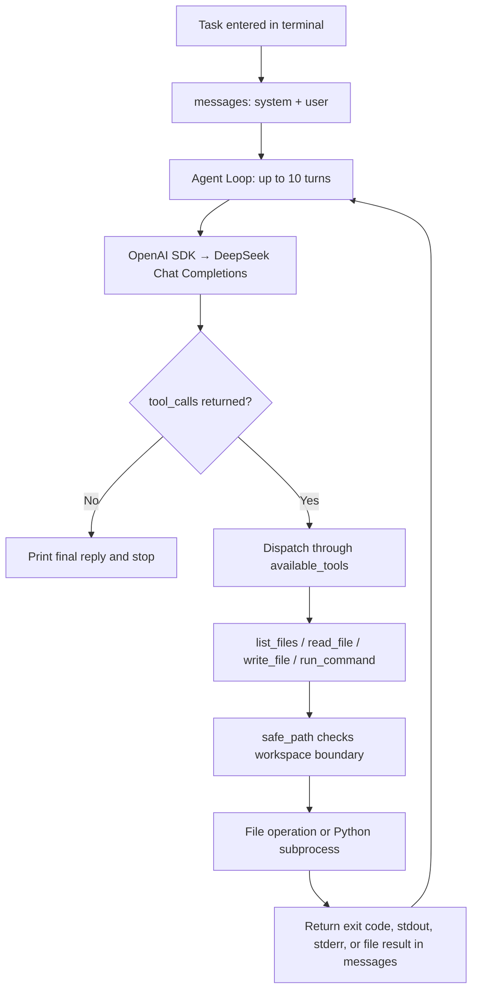

# Mini Coding Agent

[简体中文](README.md) | [English](README.en.md)

A small Python project for learning how a coding agent works. It uses the OpenAI Python SDK to call DeepSeek. Given a natural language task, the model can inspect project files, read and overwrite code, run Python scripts, and use the results in its next turn. The implementation is concentrated in [`main.py`](main.py).

## Features

- Enter one coding task in the terminal per run.
- List files, read text files, and create or fully overwrite files.
- Run a Python script and return its exit code, stdout, and stderr.
- Feed tool results back to the model for up to 10 model turns.
- See model replies, tool arguments, and tool results in the terminal.

## Run the agent

### 1. Clone and install

Use Python 3.9 or newer and a DeepSeek API key with access to the model configured in `main.py`.

```bash
git clone https://github.com/torres953190868/MiniCodingAgent.git
cd MiniCodingAgent
python3 -m venv venv
source venv/bin/activate
python -m pip install openai python-dotenv
```

On Windows PowerShell, replace the virtual environment commands with:

```powershell
python -m venv venv
.\venv\Scripts\Activate.ps1
python -m pip install openai python-dotenv
```

### 2. Set the API key

```bash
cp .env.example .env
```

On PowerShell, use `Copy-Item .env.example .env`. Edit `.env` and set `DEEPSEEK_API_KEY` to your key from the [DeepSeek platform](https://platform.deepseek.com/api_keys):

```dotenv
DEEPSEEK_API_KEY=your-api-key
```

`.env` is ignored by Git. The current configuration is:

| Setting | Current value | Location |
| --- | --- | --- |
| API key | `DEEPSEEK_API_KEY` | `.env` or environment variable |
| API base URL | `https://api.deepseek.com` | `base_url` in `main.py` |
| Model | `deepseek-v4-flash` | `model` in `main.py` |
| Maximum turns | `10` | `MAX_STEPS` in `main.py` |

The model name and URL are hardcoded. If you use another model, change the code and make sure that model supports tool calls.

### 3. Start

Run this from the project root:

```bash
python main.py
```

At the `请输入编程任务：` ("Enter a coding task") prompt, try:

```text
Read calculator.py, make divide raise a clear ValueError when the divisor is zero, update test_calculator.py, and run the test.
```

The agent sends the task to the model, executes requested tools, and returns their results to the model. It stops when the model requests no more tools or reaches 10 turns. An empty task exits immediately. Each process handles one task; conversation history stays in memory for that run, while file edits are written to disk.

## Architecture



In [`main.py`](main.py), `messages` holds the conversation. The model selects tools; `available_tools` calls the corresponding local Python functions; each result becomes a `tool` message for the next turn. The system prompt tells the model to inspect relevant files first and run a program or test after editing. A final model reply alone does not prove that a test passed; check the tool output.

### How the Agent Loop debugs code

Here, debugging means using execution results to locate and fix a code error over multiple turns. `run_command` returns the exit code, stdout, and stderr to the model. The model can use a failed test to inspect or overwrite a file, then run the test again. The terminal shows every tool call and result so you can follow its decisions. A fix depends on the model's responses and the 10-turn limit.

The demo below reproduces a concrete failure: `divide(10, 2)` returns 20 because the function uses `a * b`. The test fails with `AssertionError`; the agent changes `*` to `/` and reruns it successfully.

## Built-in tools

| Tool | Purpose | Limits |
| --- | --- | --- |
| `list_files(directory=".")` | Recursively list files | At most 200 files; skips `.git`, `venv`, `.venv`, `__pycache__` |
| `read_file(path)` | Read UTF-8 text | At most 20,000 characters returned |
| `write_file(path, content)` | Create or fully overwrite a file, creating parent directories | Cannot directly overwrite root-level `main.py` or `.env` |
| `run_command(command)` | Run a project `.py` script | Must start with `python` or `python3`; no `-c` or `-m`; 20-second timeout; at most 10,000 output characters |

Scripts run with the same Python interpreter used to start the agent. Arguments after the script name are supported, for example `python test_calculator.py`. `run_command` does not run arbitrary shell commands, pipes, or redirections. Install dependencies yourself in the terminal.

## Project layout

```text
MiniCodingAgent/
├── main.py              # Tools, model configuration, and Agent Loop
├── calculator.py        # Sample divide function
├── operations.py        # Sample add function
├── test_calculator.py   # Basic divide assertions
├── demo.py              # Reproducible offline end-to-end demonstration
├── .env.example         # Environment variable template
├── .gitignore
├── README.md            # Chinese documentation
└── README.en.md         # English documentation
```

The calculator files are practice material for the agent; they are not part of its core implementation.

## Run the sample test

This does not call the model or need an API key:

```bash
python test_calculator.py
```

It checks `divide(10, 2)` and `divide(9, 3)` and prints `所有测试通过` ("All tests passed") on success.

## Demo: run the whole Agent Loop offline

After installing the dependencies above, run this from the project root:

```bash
python demo.py
```

The demo needs **no API key or network access**. [`demo.py`](demo.py) supplies fixed model responses while executing the real Agent Loop and all four tools from `main.py`. It seeds a `return a * b` bug in a temporary copy of `calculator.py` and uses the existing test to show failure, repair, and retesting. It does not edit repository files. To use a live model, follow [Run the agent](#run-the-agent) and execute `python main.py`.

### Complete trajectory

This is the complete output of `python demo.py`. Turn 6 follows the final explanation from the original debugging record. Fixed model responses reconstruct turns 1–5; the file operations, failed test, and successful retest actually run. The temporary path is shown as `<demo-workspace>` to keep the output reproducible. This is an offline reconstruction, not a live DeepSeek API log. The Chinese log follows six steps: list files, read code and test, see a failing test, fix the operator, pass the test, and summarize.

Log labels: `第 N 轮` = turn N, `调用工具` = tool call, `参数` = arguments, `工具结果` = tool result, `退出码` = exit code, `标准输出` = stdout, and `错误输出` = stderr. The final reply explains that `a * b` returned 20 for `divide(10, 2)`, the initial test exited with code 1 and `AssertionError`, replacing `*` with `/` made the retest exit with code 0, and neither `main.py` nor `.env` was changed.

~~~~text
请输入编程任务：请检查 calculator.py 中的 divide 函数，运行 test_calculator.py，修复测试失败的问题并再次验证。

=============== 第 1 轮 ===============

调用工具：list_files
参数：{}

工具结果：
calculator.py
main.py
test_calculator.py

=============== 第 2 轮 ===============

调用工具：read_file
参数：{'path': 'calculator.py'}

工具结果：
def divide(a, b):
    return a * b


调用工具：read_file
参数：{'path': 'test_calculator.py'}

工具结果：
from calculator import divide


assert divide(10, 2) == 5
assert divide(9, 3) == 3

print("所有测试通过")

=============== 第 3 轮 ===============

调用工具：run_command
参数：{'command': 'python test_calculator.py'}

工具结果：
退出码：1
标准输出：

错误输出：
Traceback (most recent call last):
  File "<demo-workspace>/test_calculator.py", line 4, in <module>
    assert divide(10, 2) == 5
AssertionError


=============== 第 4 轮 ===============

调用工具：write_file
参数：{'path': 'calculator.py', 'content': 'def divide(a, b):\n    return a / b\n'}

工具结果：
文件写入成功：calculator.py
共写入 35 个字符。

=============== 第 5 轮 ===============

调用工具：run_command
参数：{'command': 'python test_calculator.py'}

工具结果：
退出码：0
标准输出：
所有测试通过

错误输出：


=============== 第 6 轮 ===============

模型：
测试通过。

## 修改说明

**问题**：`calculator.py` 中的 `divide` 函数实现错误，做的是乘法而不是除法：
```python
def divide(a, b):
    return a * b   # 错误
```

这导致测试 `assert divide(10, 2) == 5` 失败（返回 20 而不是 5）。

**修改**：将运算符由 `*` 改为 `/`：
```python
def divide(a, b):
    return a / b
```

**测试结果**：

- 修改前：退出码 1，`AssertionError`（断言失败）
- 修改后：退出码 0，输出 `所有测试通过`

未改动 `main.py` 和 `.env`。

Agent 已结束任务。
~~~~

## Operating boundaries

- The workspace is the process's starting directory (`Path.cwd()`). File and script paths are checked against it.
- These checks are not an OS sandbox. Python scripts run with the current user's permissions and can access resources outside the project. The protected-file rule applies only to `write_file`.
- `read_file` can read sensitive files such as `.env`, and their content would enter the model request. Use a practice project without sensitive data.
- Edits need no per-file confirmation and have no automatic backup or rollback. Save your starting state with Git and inspect `git diff` afterward.
- There is no streaming, session persistence, or automatic recovery after an API error. An API error may terminate the process.

## Troubleshooting

**`KeyError: 'DEEPSEEK_API_KEY'`**: Create `.env` with the key or export `DEEPSEEK_API_KEY` in your shell.

**`ModuleNotFoundError`**: Activate the virtual environment and run `python -m pip install openai python-dotenv`.

**API call fails or model unavailable**: Check connectivity, the key, account status, and whether the model configured in `main.py` is available to your account.

**Ten turns reached before completion**: Inspect file edits and test results, then retry with a smaller task or change `MAX_STEPS` if appropriate.
