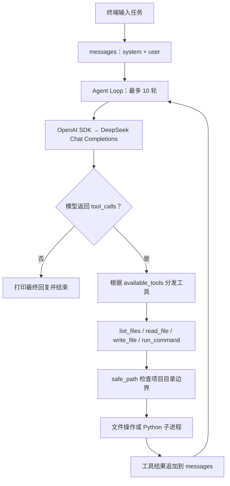

# Mini Coding Agent

[简体中文](README.md) | [English](README.en.md)

一个用于学习 Coding Agent 工作原理的轻量级 Python 项目。通过 OpenAI Python SDK 调用 DeepSeek，让模型根据自然语言任务查看项目、读取和修改代码、运行 Python 脚本，并根据执行结果继续处理任务。

核心逻辑集中在 `main.py`，可以直接阅读工具定义、工具调用和 Agent Loop 的实现。

## 功能

- **自然语言任务**：启动后在终端输入一次编程任务。
- **文件操作**：列出项目文件、读取文本、创建或完整覆盖文件。
- **运行验证**：执行项目内的 Python 脚本，返回退出码、标准输出和错误输出。
- **多轮工具调用**：把工具结果写回对话，让模型继续分析和修改，最多运行 10 轮。
- **过程可见**：在终端打印模型回复、工具参数和执行结果。

## 快速开始

### 1. 获取项目并安装依赖

需要 Python 3.9 或更高版本，以及可调用代码中所配置模型的 DeepSeek API Key。

```bash
git clone https://github.com/torres953190868/MiniCodingAgent.git
cd MiniCodingAgent

python3 -m venv venv
source venv/bin/activate
python -m pip install openai python-dotenv
```

Windows PowerShell 使用以下命令创建并激活虚拟环境，然后执行同样的依赖安装命令：

```powershell
python -m venv venv
.\venv\Scripts\Activate.ps1
python -m pip install openai python-dotenv
```

### 2. 配置 API Key

复制配置模板：

```bash
cp .env.example .env
```

Windows PowerShell 可以使用 `Copy-Item .env.example .env`。

编辑 `.env`，填入从 [DeepSeek 开放平台](https://platform.deepseek.com/api_keys) 获取的密钥：

```dotenv
DEEPSEEK_API_KEY=你的_API_Key
```

`.env` 已加入 `.gitignore`，不要将真实密钥提交到仓库。

当前代码使用以下配置：

| 配置 | 当前值 | 修改位置 |
| --- | --- | --- |
| API Key | `DEEPSEEK_API_KEY` | `.env` 或环境变量 |
| API 地址 | `https://api.deepseek.com` | `main.py` 中的 `base_url` |
| 模型 | `deepseek-v4-flash` | `main.py` 中的 `model` |
| 最大轮数 | `10` | `main.py` 中的 `MAX_STEPS` |

模型名和 API 地址目前直接写在代码中；使用其他模型时，需要自行修改配置并确认其支持工具调用。

### 3. 启动 Agent

请在项目根目录运行：

```bash
python main.py
```

出现 `请输入编程任务：` 后，可以输入：

```text
请查看 calculator.py，为 divide 函数增加除数为零时的处理，更新 test_calculator.py 并运行测试。
```

Agent 会向模型发送任务，执行模型申请的工具，并将结果反馈给模型。模型不再申请工具时结束；达到 10 轮也会停止。输入空任务会直接退出。

每次启动处理一个任务，对话历史仅保存在本次进程内。文件修改会直接写入磁盘。

## 架构图



核心实现在 [`main.py`](main.py)：`messages` 保存对话，模型选择工具，`available_tools` 调用本地函数，结果以 `tool` 消息写回对话。系统提示词要求先查看相关文件，修改后运行程序或测试，失败时继续修正。实际执行过程以终端中的工具结果为准；模型结束回复并不等同于测试一定通过。

## 内置工具

| 工具 | 用途 | 限制 |
| --- | --- | --- |
| `list_files(directory=".")` | 递归列出文件 | 最多返回 200 个文件；忽略 `.git`、`venv`、`.venv`、`__pycache__` |
| `read_file(path)` | 以 UTF-8 读取文本 | 返回内容最多 20,000 个字符 |
| `write_file(path, content)` | 创建或完整覆盖文件，自动创建父目录 | 拒绝直接写入根目录的 `main.py` 和 `.env` |
| `run_command(command)` | 执行项目中的 `.py` 脚本 | 命令以 `python` 或 `python3` 开头；不支持 `-c`、`-m`；超时 20 秒；返回内容最多 10,000 个字符 |

脚本由启动 Agent 的同一个 Python 解释器执行，也可以附带脚本参数。例如：

```text
python test_calculator.py
```

`run_command` 不支持任意 Shell 命令，也不会解释管道或重定向。安装依赖等操作需要自行在终端完成。

## 项目结构

```text
MiniCodingAgent/
├── main.py              # 工具实现、模型配置和 Agent Loop
├── calculator.py        # 示例：divide 除法函数
├── operations.py        # 示例：独立的 add 加法函数
├── test_calculator.py   # divide 的基础断言测试
├── demo.py              # 不访问 API 的可复现完整演示
├── .env.example         # 环境变量模板
├── .gitignore
├── README.md            # 中文文档
└── README.en.md         # English documentation
```

`calculator.py`、`operations.py` 和 `test_calculator.py` 是供 Agent 练习读取、修改和验证的示例文件，不属于 Agent 核心逻辑。

## 运行示例测试

不调用模型、不需要 API Key：

```bash
python test_calculator.py
```

当前测试检查 `divide(10, 2)` 和 `divide(9, 3)`，成功时输出：

```text
所有测试通过
```

## Demo：离线运行完整 Agent Loop

安装上述依赖后，在项目根目录执行：

```bash
python demo.py
```

这个 Demo **不需要 API Key，也不发送网络请求**。`demo.py` 用固定的模型响应替代在线模型，但实际运行 [`main.py`](main.py) 中的 Agent Loop 和四个工具中的 `read_file`、`write_file`、`run_command`。它先把示例文件复制到临时目录，因此不会修改仓库中的 `calculator.py` 和 `test_calculator.py`。需要体验在线模型时，按[快速开始](#快速开始)配置密钥并运行 `python main.py`。

### 完整 trajectory

以下是执行 `python demo.py` 的完整终端记录。模型响应由 Demo 固定提供；文件读取、写入、测试输出和 Agent Loop 均由程序真实执行。每轮都列出工具调用与结果，最后一轮给出最终回复。

```text
请输入编程任务：请读取 calculator.py 和 test_calculator.py，为 divide 增加除数为零时的明确报错，补充测试并运行 python test_calculator.py。

=============== 第 1 轮 ===============

调用工具：read_file
参数：{'path': 'calculator.py'}

工具结果：
def divide(a, b):
    return a / b


调用工具：read_file
参数：{'path': 'test_calculator.py'}

工具结果：
from calculator import divide


assert divide(10, 2) == 5
assert divide(9, 3) == 3

print("所有测试通过")

=============== 第 2 轮 ===============

调用工具：write_file
参数：{'path': 'calculator.py', 'content': 'def divide(a, b):\n    if b == 0:\n        raise ValueError("除数不能为零")\n    return a / b\n'}

工具结果：
文件写入成功：calculator.py
共写入 85 个字符。

调用工具：write_file
参数：{'path': 'test_calculator.py', 'content': 'from calculator import divide\n\n\nassert divide(10, 2) == 5\nassert divide(9, 3) == 3\n\ntry:\n    divide(1, 0)\nexcept ValueError as error:\n    assert str(error) == "除数不能为零"\nelse:\n    raise AssertionError("除数为零时应抛出 ValueError")\n\nprint("所有测试通过")\n'}

工具结果：
文件写入成功：test_calculator.py
共写入 239 个字符。

=============== 第 3 轮 ===============

调用工具：run_command
参数：{'command': 'python test_calculator.py'}

工具结果：
退出码：0
标准输出：
所有测试通过

错误输出：


=============== 第 4 轮 ===============

模型：
已为 divide 增加除数为零时的 ValueError，补充测试；测试通过。

Agent 已结束任务。
```

## 运行边界

- 工作目录取自启动时的当前目录（`Path.cwd()`）。文件工具及待运行脚本的路径会经过目录边界检查。
- 这些检查不是操作系统沙箱。执行的 Python 脚本仍拥有当前用户的权限，能够访问项目外资源；受保护文件的写入限制也只作用于 `write_file` 工具。
- `read_file` 没有屏蔽 `.env` 等敏感文件，读取结果会进入模型请求。建议在不含敏感数据的练习项目中使用。
- 修改无需逐次确认，且没有自动备份或回滚。运行前可以用 Git 保存工作状态，运行后通过 `git diff` 检查改动。
- 当前没有流式输出、会话持久化或 API 请求失败后的自动恢复；API 异常可能使程序退出。

## 常见问题

**提示 `KeyError: 'DEEPSEEK_API_KEY'`**

确认已创建 `.env` 并设置 `DEEPSEEK_API_KEY`，或已在当前终端设置同名环境变量。

**提示 `ModuleNotFoundError`**

确认已激活虚拟环境，并在该环境中执行 `python -m pip install openai python-dotenv`。

**API 调用失败或模型不可用**

检查网络、API Key、账户状态，以及 `main.py` 中配置的模型是否对当前账户可用。

**达到最大轮数但任务未完成**

先检查已产生的文件改动和测试结果，再将任务拆小后重新运行；也可以按需调整 `MAX_STEPS`。
